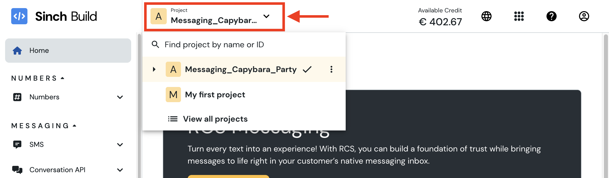

# Sinch MCP Server — Developer Preview

This repository contains the source code for the Sinch MCP server, which provides a set of tools to interact with the Sinch APIs. This README focuses on using the MCP server with the [Claude Desktop](https://claude.ai/download) client, but it can also be used with any other MCP client.

## Tools Overview

Here is the list of tools available in the MCP server (all the phone numbers must be provided in E.164 format, e.g., `+33612345678` for France).

### Conversation Tools

| Tool                         | Description                                                                                                                                                                                                                                                                       | Tags                       |
|------------------------------|-----------------------------------------------------------------------------------------------------------------------------------------------------------------------------------------------------------------------------------------------------------------------------------|----------------------------|
| **send-text-message**        | Send a plain text message to a recipient on a supported channel. <br> *Example prompt*: "Send a quick update to the phone number +33612345678 on SMS."                                                                                                                            | conversation, notification |
| **send-media-message**       | Send an image, video, or document via a media message. <br> *Example prompt*: "Send the product brochure PDF to the phone number +33612345678 on WhatsApp."                                                                                                                       | conversation, notification |
| **send-template-message**    | Send a message using a predefined template (e.g., WhatsApp or omni-template). <br> *Example prompt*: "Send the appointment reminder template in Spanish to this user on Messenger."                                                                                               | conversation, notification |
| **send-choice-message**      | Send a message that includes interactive choices (buttons or quick replies). <br> *Example prompt*: "Send a RCS survey about preferred ice cream flavor to +33662162504 with the following choices: Vanilla, Strawberry, Hazelnut".                                               | conversation, notification |
| **send-location-message**    | Send a location pin or coordinates to a user. <br> *Example prompt*: "Send a pin to the Guggenheim Museum location in Bilbao to the phone number +33612345678."                                                                                                                   | conversation, notification |
| **get-message-events**       | Retrieve events related to a specific message, such as delivery status or read receipts.<br>⚠️ Only the events received during the time the MCP server is online can be retrieved. <br> *Example prompt*: "What is the delivery status of the message 01JXYH8RB8MZCAFR117KQAQMQ0" | conversation, notification |
| **list-all-apps**            | List all configured Conversation apps in the Sinch account. <br> *Example prompt*: "What messaging apps do I have set up in my account?"                                                                                                                                          | conversation, notification |
| **list-messaging-templates** | List all omni-channel and channel-specific message templates. <br> *Example prompt*: "Show me all message templates in my account."                                                                                                                                               | conversation, notification |


### Email tools (Mailgun)

| Tool                     | Description                                                                                                                                                                                          | Tags                |
|--------------------------|------------------------------------------------------------------------------------------------------------------------------------------------------------------------------------------------------|---------------------|
| **send-email**           | Send an email using a predefined HTML template or raw HTML/text content. <br> *Example prompt*: "Send a welcome email to [john@example.com](mailto:john@example.com) using our onboarding template." | email, notification |
| **list-email-templates** | List all email templates available for a specific domain. <br> *Example prompt*: "What email templates do I have available?"                                                                         | email, notification |
| **retrieve-email-info**  | Retrieve metadata, content and delivery status for a specific email message. <br> *Example prompt*: "Can you get the delivery status of the email with ID <email-id>?"                               | email, notification |
| **list-email-events**    | Retrieve and group recent email delivery events, such as bounces, opens, or clicks. <br> *Example prompt*: "Show me all recent email activity for my account."                                       | email               |
| **analytics-metrics**    | Retrieve email analytics metrics, such as open rates or click-through rates. <br> *Example prompt*: "What are the open rates during the last week?"                                                  | email               |

### Verification Tools

| Tool                              | Description                                                                                                                                             | Tags                       |
|-----------------------------------|---------------------------------------------------------------------------------------------------------------------------------------------------------|----------------------------|
| **number-lookup**                 | Lookup a phone number for its status and capabilities. <br> *Example prompt*: "Lookup for the following phone number capabilities: +33501020304."       | verification               |
| **start-sms-verification**        | Initiate an SMS verification by sending an OTP to a user's phone number. <br> *Example prompt*: "Start phone verification for the number +33612345678." | verification               |
| **report-sms-verification**       | Submit a one-time password (OTP) to complete SMS verification. <br> *Example prompt*: "Verify the phone number with this code: 1234."                   | verification               |

### Voice Tools

| Tool                              | Description                                                                                                                                                                                              | Tags                       |
|-----------------------------------|----------------------------------------------------------------------------------------------------------------------------------------------------------------------------------------------------------|----------------------------|
| **tts-callout**                   | Place a voice call and read aloud a message using Text-to-Speech. <br> *Example prompt*: "Call the phone number +33612345678 and say: 'Your appointment is tomorrow at 10 AM.'"                          | voice, notification        |
| **conference-call**               | Start a voice call to one or more participants and connect them to a shared conference. <br> *Example prompt*: "Call John (+33612345678) and Lisa (+34987654321) and connect them to a conference room." | voice                      |
| **manage-conference-participant** | Mute, unmute, hold, or resume an individual participant in a conference call. <br> *Example prompt*: "Mute the caller with ID xyz789 in the conference."                                                 | voice                      |
| **close-conference**              | End a conference call by disconnecting all the participants using the ID of the conference. <br> *Example prompt*: "End the current conference call with ID abc123."                                     | voice                      |

### Configuration Tools

| Tool                        | Description                                                                                                                                                                                           | Tags |
|-----------------------------|-------------------------------------------------------------------------------------------------------------------------------------------------------------------------------------------------------|------|
| **sinch-mcp-configuration** | List all available tools in the Sinch MCP server and their status. If a tool is disabled, it will display the reason why. <br> *Example prompt*: "Which tools are available in the Sinch MCP server?" |      |

## Getting Started

### Prerequisites

- [Node.js >= 20.18.1](https://nodejs.org/en/download)
- A provisioned [Sinch Build account](https://dashboard.sinch.com/dashboard)
- Claude Desktop (or any other MCP client). This README is focused on [Claude Desktop](https://claude.ai/download), but the MCP server can be used with any MCP client.

### API credentials

To use the APIs used by the MCP tools, you will need the following credentials:
- Conversation API credentials:
  - (Required) `CONVERSATION_PROJECT_ID`: Select the project you want to use from your [Sinch Build dashboard](https://dashboard.sinch.com/dashboard) (Located at the left of the top toolbar)

  - (Required) `CONVERSATION_KEY_ID`: Select or create a new access key in the [Access keys section](https://dashboard.sinch.com/settings/access-keys) of the Sinch Build dashboard.
  - (Required) `CONVERSATION_KEY_SECRET`: This is the secret associated with the `Access Key` you selected or created in the previous step. Be careful, the `Access Key Secret` is only shown once when you create the `Access Key`. If you lose it, you will need to create a new `Access Key`.
  - `CONVERSATION_APP_ID`: This is the ID of the conversation app you want to use. You can find it in the [Conversation API / Apps section](https://dashboard.sinch.com/convapi/apps) of the Sinch Build dashboard. If you don't set it, you will have to specify it in the prompt.
  - `CONVERSATION_REGION`: This is the region where your conversation app and templates are located. It can be `us`, `eu`, or `br`. If you don't set it, it defaults to `us`.
  - When using the SMS channel, you can also set the `DEFAULT_SMS_ORIGINATOR` environment variable to the phone number that will be used as the sender for SMS messages. Depending on your country, this setting may be required.
  - You can also set the `GEOCODING_API_KEY` environment variable to your Google Geocoding API key if you want to use the location feature. This is needed to convert an address to a latitude/longitude pair.
  - `NGROK_AUTH_TOKEN`: If you want to use the tool `get-message-events`, you have to be able to receive events related to a message. If this variable is set, the MCP server will open a tunnel to your local machine using [ngrok](https://dashboard.ngrok.com/get-started/your-authtoken). If you don't set this variable, the MCP server will not be able to receive events related to a message.
- Verification API credentials: navigate to the [Verification / Apps section](https://dashboard.sinch.com/verification/apps) of the Sinch Build dashboard and create a new app or select an existing one. You will need the following credentials:
  - (Required) `VERIFICATION_APPLICATION_KEY`
  - (Required) `VERIFICATION_APPLICATION_SECRET`
- Voice API credentials: navigate to the [Voice / Apps section](https://dashboard.sinch.com/voice/apps) of the Sinch Build dashboard and create a new app or select an existing one. You will need the following credentials:
  - (Required) `VOICE_APPLICATION_KEY`
  - (Required) `VOICE_APPLICATION_SECRET`
  - You can also set the `CALLING_LINE_IDENTIFICATION` environment variable to the phone number that will be displayed to the user when they receive a call.
- Mailgun API credentials: navigate to the [Mailgun / Domains section](https://app.mailgun.com/app/domains) of the Mailgun dashboard and create a new domain or select an existing one. You will need the following credentials:
  - (Required) `MAILGUN_API_KEY`
  - `MAILGUN_DOMAIN`
  - `MAILGUN_SENDER_ADDRESS`

### MCP Server Configuration

The Sinch MCP server is available as an NPM package to the executed. Here is how to set it up in the [Claude Desktop](https://claude.ai/download) configuration file (`claude_desktop_config.json`). Remember to fill in the environment variables with your own credentials:

```json
{
  "mcpServers": {
    "sinch": {
      "command": "npx",
      "args": [
        "-y",
        "@sinch/mcp"
      ],
      "env": {
        "CONVERSATION_PROJECT_ID": "",
        "CONVERSATION_KEY_ID": "",
        "CONVERSATION_KEY_SECRET": "",
        "CONVERSATION_APP_ID": "",
        "CONVERSATION_REGION": "",
        "DEFAULT_SMS_ORIGINATOR": "",
        "GEOCODING_API_KEY": "",
        "NGROK_AUTH_TOKEN": "",
        "VERIFICATION_APPLICATION_KEY": "",
        "VERIFICATION_APPLICATION_SECRET": "",
        "VOICE_APPLICATION_KEY": "",
        "VOICE_APPLICATION_SECRET": "",
        "CALLING_LINE_IDENTIFICATION": "",
        "MAILGUN_API_KEY": "",
        "MAILGUN_DOMAIN": "",
        "MAILGUN_SENDER_ADDRESS": ""
      }
    }
  }
}
```


# Running the MCP Server locally

## Option 1: Start the MCP server with stdio using Claude Desktop

To run the MCP server locally with Claude Desktop, you will need to clone the repository and build the MCP server. This option is useful for local development and testing.

### Step 1: Clone the repository

```bash
git clone https://github.com/sinch/sinch-mcp-server.git
```

### Step 2: Build the MCP server

```bash
cd sinch-mcp-server/mcp
npm install
npm run build
```

### Step 3: Setup Claude Desktop configuration

Here is an example of how to configure the MCP server in the [Claude Desktop](https://claude.ai/download) configuration file (`claude_desktop_config.json`):

```json
{
  "mcpServers": {
    "sinch": {
      "command": "node",
      "args": [
        "/your/path/to/sinch-mcp-server/mcp/dist/index.js"
      ],
      "env": {
        "CONVERSATION_PROJECT_ID": "",
        "CONVERSATION_KEY_ID": "",
        "CONVERSATION_KEY_SECRET": "",
        "CONVERSATION_APP_ID": "",
        "CONVERSATION_REGION": "",
        "DEFAULT_SMS_ORIGINATOR": "",
        "GEOCODING_API_KEY": "",
        "NGROK_AUTH_TOKEN": "",
        "VERIFICATION_APPLICATION_KEY": "",
        "VERIFICATION_APPLICATION_SECRET": "",
        "VOICE_APPLICATION_KEY": "",
        "VOICE_APPLICATION_SECRET": "",
        "CALLING_LINE_IDENTIFICATION": "",
        "MAILGUN_API_KEY": "",
        "MAILGUN_DOMAIN": "",
        "MAILGUN_SENDER_ADDRESS": ""
      }
    }
  }
}
```

### Step 4: (Optional) Filter the tools available in the MCP server

Too many tools mean bigger context, mean higher tokens usage and more confusion for the LLM to select the right tool to use.<br>
You can filter the tools that are available in the MCP server by using the `tags` options. For example, if you want to only use the conversation tools, you can add the following options to the `args` array:
```
      "args": [
        "/your/path/to/sinch-mcp-server/mcp/dist/index.js",
        "--tags", 
        "conversation"
      ],
```
You can combine multiple tags by separating them with commas. For example, if you want to use both conversation and verification tools, you can use the following command:
```
      "args": [
        "/your/path/to/sinch-mcp-server/mcp/dist/index.js",
        "--tags", 
        "conversation,verification"
      ],
```
If you want to use all the tools, you can omit the `--tags` option, or use the tag `all`:
```
      "args": [
        "/your/path/to/sinch-mcp-server/mcp/dist/index.js",
        "--tags", 
        "all"
      ],
```


## Option 2: Start the MCP server remotely and connect to it using SSE

With this option, you can run the MCP server on a remote machine and connect to it using Server-Sent Events (SSE). This is useful if you want to run the MCP server on a cloud server or a dedicated machine.
By default, Claude Desktop will connect to the MCP server using STDIO; we will use the [supergateway library](https://github.com/supercorp-ai/supergateway) to connect to the MCP server using SSE.

### Step 1: Build the MCP server

```bash
cd sinch-mcp-server
npm install
npm run build
```

### Step 2: Set up the MCP server configuration

Copy the file `.template.env` and rename it `.env`. Then replace the placeholders with your own credentials and delete any key you don't need. The `.env` file should look like this ():
```dotenv
# Conversation tools related environment variables
CONVERSATION_PROJECT_ID=
CONVERSATION_KEY_ID=
CONVERSATION_KEY_SECRET=
## Optional but recommended: the App ID holding your channels integration configuration. If not set it must be present in the prompt
CONVERSATION_APP_ID=
## Optional, defaults to "us". Other possible values are "eu" and "br"
CONVERSATION_REGION=
## Needed only if you want to send SMS messages: it is the number that will be used as the sender for SMS messages
DEFAULT_SMS_ORIGINATOR=
## Needed only if you want to send location messages: it converts an address to a latitude/longitude pair
GEOCODING_API_KEY=
## Token to be obtained at https://dashboard.ngrok.com/get-started/your-authtoken to enable the "get-message-events" tool
NGROK_AUTH_TOKEN=

# Verification tools related environment variables
VERIFICATION_APPLICATION_KEY=
VERIFICATION_APPLICATION_SECRET=

# Voice tools related environment variables (Application key and secret can be the same as for Verification)
VOICE_APPLICATION_KEY=
VOICE_APPLICATION_SECRET=
## Needed only if you want to make calls: it is the number that will be displayed to the user when they receive a call
CALLING_LINE_IDENTIFICATION=

# Mailgun tools related environment variables
MAILGUN_DOMAIN=
MAILGUN_API_KEY=
MAILGUN_SENDER_ADDRESS=
```

### Step 3: Start the MCP server

```bash
npm run start
```

By default, this command will start the MCP with all the tools available. If you want to filter the tools that are available in the MCP server, you can use the `--tags` option. For example, if you want to only use the conversation tools, you can modify the command as follows:
```bash
# Original command
"start": "tsc && (npx -y supergateway --stdio \"node dist/index.js\" --port 8000 --baseUrl http://localhost:8000 --ssePath /sse --messagePath /message)"

# Modified command to only use conversation tools
"start": "tsc && (npx -y supergateway --stdio \"node dist/index.js --tag conversation\" --port 8000 --baseUrl http://localhost:8000 --ssePath /sse --messagePath /message)"
```

You can combine multiple tags by separating them with commas. For example, if you want to use both conversation and verification tools, you can use the following command:
```bash
"start": "tsc && (npx -y supergateway --stdio \"node dist/index.js --tag conversation,verification\" --port 8000 --baseUrl http://localhost:8000 --ssePath /sse --messagePath /message)"
```

### Step 4: Configure the MCP server in Claude Desktop

You can then configure the MCP server in the Claude configuration file as follows:
```json
{
  "mcpServers": {
    "sinch": {
      "command": "npx",
      "args": [
        "-y", "supergateway", "--sse", "http://localhost:8000/sse"
      ]
    }
  }
}
```
(Replace the `http://localhost:8000/sse` with the URL of your MCP server if it is not running locally)


## Contributing: Defining new tools

Tools are registered in the `src/index.ts` file.
- Conversation tools: send various types of messages, list conversation apps, templates
- Verification tools: lookup for a number, perform a verification flow
- Voice tools: make a TTS call, create a conference call, manage participants
- Email tools: send emails, retrieve email information

Tools are defined under `src/tools/` and are registered in the `index.ts` file of their respective domain folder.
- Conversation tools: `src/tools/conversation/index.ts`
- Verification tools: `src/tools/verification/index.ts`
- Voice tools: `src/tools/voice/index.ts`
- Email tools: `src/tools/email/index.ts`
