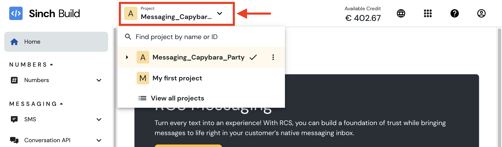

# Sinch MCP Server — Developer Preview

[](https://www.npmjs.com/package/@sinch/mcp)

This repository contains the source code for the Sinch MCP server, which provides a set of tools to interact with the Sinch APIs. This README focuses on using the MCP server with the [Claude Desktop](https://claude.ai/download) client, but it can also be used with any other MCP client.

## Tools Overview

Here is the list of tools available in the MCP server (all the phone numbers must be provided in E.164 format, e.g., `+33612345678` for France).

### Conversation Tools

| Tool                               | Description                                                                                                                                                                                                                         | Tags                        |
| ---------------------------------- | ----------------------------------------------------------------------------------------------------------------------------------------------------------------------------------------------------------------------------------- | --------------------------- |
| **send-text-message**              | Send a plain text message to a recipient on a supported channel. <br> _Example prompt_: "Send a quick update to the phone number +33612345678 on SMS."                                                                              | conversation, notification  |
| **send-media-message**             | Send an image, video, or document via a media message. <br> _Example prompt_: "Send the product brochure PDF to the phone number +33612345678 on WhatsApp."                                                                         | conversation, notification  |
| **send-template-message**          | Send a message using a predefined template (omni-template only). <br> _Example prompt_: "Send the appointment reminder template in Spanish to this user on Messenger."                                                              | conversation, notification  |
| **send-whatsapp-template-message** | Send a message using a predefined WhatsApp template. <br> _Example prompt_: "Send a message using the template "appointment-reminder" on WhatsApp."                                                                                 | conversation, notification  |
| **send-choice-message**            | Send a message that includes interactive choices (buttons or quick replies). <br> _Example prompt_: "Send a RCS survey about preferred ice cream flavor to +33612345678 with the following choices: Vanilla, Strawberry, Hazelnut". | conversation, notification  |
| **send-location-message**          | Send a location pin or coordinates to a user. <br> _Example prompt_: "Send a pin to the Guggenheim Museum location in Bilbao to the phone number +33612345678."                                                                     | conversation, notification  |
| **list-conversation-apps**         | List all configured Conversation apps in the Sinch account. <br> _Example prompt_: "What messaging apps do I have set up in my account?"                                                                                            | conversation, notification  |
| **create-conversation-app**        | Create a new Conversation API app (no channels required at creation). <br> _Example prompt_: "Create a Conversation app named My Support Bot in the EU region."                                                                     | conversation, configuration |
| **set-sms-channel-on-app**         | Set (create or replace) the SMS channel on a Conversation app. <br> _Example prompt_: "Set SMS on app abc123 using service plan XYZ and API token …"                                                                                | conversation, configuration |
| **set-rcs-channel-on-app**         | Set (create or replace) the RCS channel on a Conversation app. <br> _Example prompt_: "Set RCS on app abc123 with sender ID … and bearer token …"                                                                                   | conversation, configuration |
| **set-whatsapp-channel-on-app**    | Set (create or replace) the WhatsApp channel on a Conversation app. <br> _Example prompt_: "Set WhatsApp on app abc123 with sender ID … and bearer token …"                                                                         | conversation, configuration |
| **list-messaging-templates**       | List all omni-channel and channel-specific message templates. <br> _Example prompt_: "Show me all message templates in my account."                                                                                                 | conversation, notification  |
| **list-webhooks**                  | List webhooks configured for a Conversation app. <br> _Example prompt_: "List all webhooks for my Conversation app."                                                                                                                | conversation, configuration |
| **get-webhook**                    | Get a webhook by ID. <br> _Example prompt_: "Show me the details of webhook ID abc123."                                                                                                                                             | conversation, configuration |
| **create-webhook**                 | Create a webhook that delivers Conversation API events to a target URL. <br> _Example prompt_: "Create a webhook for inbound messages at https://example.com/callback."                                                             | conversation, configuration |
| **update-webhook**                 | Update a webhook target URL and/or triggers. <br> _Example prompt_: "Update webhook abc123 to also receive MESSAGE_DELIVERY events."                                                                                                | conversation, configuration |
| **delete-webhook**                 | Delete a webhook by ID. <br> _Example prompt_: "Delete webhook abc123."                                                                                                                                                             | conversation, configuration |

### Email tools (Mailgun)

| Tool                     | Description                                                                                                                                                                                          | Tags                |
| ------------------------ | ---------------------------------------------------------------------------------------------------------------------------------------------------------------------------------------------------- | ------------------- |
| **send-email**           | Send an email using a predefined HTML template or raw HTML/text content. <br> _Example prompt_: "Send a welcome email to [john@example.com](mailto:john@example.com) using our onboarding template." | email, notification |
| **list-email-templates** | List all email templates available for a specific domain. <br> _Example prompt_: "What email templates do I have available?"                                                                         | email, notification |
| **retrieve-email-info**  | Retrieve metadata, content and delivery status for a specific email message. <br> _Example prompt_: "Can you get the delivery status of the email with ID <email-id>?"                               | email, notification |
| **list-email-events**    | Retrieve and group recent email delivery events, such as bounces, opens, or clicks. <br> _Example prompt_: "Show me all recent email activity for my account."                                       | email               |
| **analytics-metrics**    | Retrieve email analytics metrics, such as open rates or click-through rates. <br> _Example prompt_: "What are the open rates during the last week?"                                                  | email               |

### Verification Tools

| Tool                        | Description                                                                                                                                             | Tags         |
| --------------------------- | ------------------------------------------------------------------------------------------------------------------------------------------------------- | ------------ |
| **number-lookup**           | Lookup a phone number for its status and capabilities. <br> _Example prompt_: "Lookup for the following phone number capabilities: +33501020304."       | verification |
| **start-sms-verification**  | Initiate an SMS verification by sending an OTP to a user's phone number. <br> _Example prompt_: "Start phone verification for the number +33612345678." | verification |
| **report-sms-verification** | Submit a one-time password (OTP) to complete SMS verification. <br> _Example prompt_: "Verify the phone number with this code: 1234."                   | verification |

### Voice Tools

| Tool                              | Description                                                                                                                                                                                              | Tags                |
| --------------------------------- | -------------------------------------------------------------------------------------------------------------------------------------------------------------------------------------------------------- | ------------------- |
| **tts-callout**                   | Place a voice call and read aloud a message using Text-to-Speech. <br> _Example prompt_: "Call the phone number +33612345678 and say: 'Your appointment is tomorrow at 10 AM.'"                          | voice, notification |
| **conference-callout**            | Start a voice call to one or more participants and connect them to a shared conference. <br> _Example prompt_: "Call John (+33612345678) and Lisa (+34987654321) and connect them to a conference room." | voice               |
| **manage-conference-participant** | Mute, unmute, hold, or resume an individual participant in a conference call. <br> _Example prompt_: "Mute the caller with ID xyz789 in the conference."                                                 | voice               |
| **close-conference**              | End a conference call by disconnecting all the participants using the ID of the conference. <br> _Example prompt_: "End the current conference call with ID abc123."                                     | voice               |
| **get-call-information**          | Get information about a call using its ID. <br> _Example prompt_: "Get the details of call ID abc123."                                                                                                  | voice, notification |

### RCS Sender Tools

| Tool                              | Description                                                                                                                                                                                                                                        | Tags               |
| --------------------------------- | -------------------------------------------------------------------------------------------------------------------------------------------------------------------------------------------------------------------------------------------------- | ------------------ |
| **list-rcs-senders**              | List all RCS senders for the project, with pagination support. <br> _Example prompt_: "Show me all my RCS senders."                                                                                                                                | rcs, configuration |
| **get-rcs-sender**                | Get a full RCS sender by ID, including credentials, state, brand details, test numbers, and country status. <br> _Example prompt_: "Get the details of my RCS sender abc123."                                                                      | rcs, configuration |
| **create-rcs-sender**             | Create a new RCS sender. Brand details, questionnaire, and countries can be provided upfront or added incrementally via update-rcs-sender. <br> _Example prompt_: "Create an RCS sender for the EU region with a CONVERSATIONAL billing category." | rcs, configuration |
| **update-rcs-sender**             | Update an RCS sender's brand, countries, test numbers, or questionnaire. <br> _Example prompt_: "Update my RCS sender abc123 with the brand logo URL."                                                                                             | rcs, configuration |
| **launch-rcs-sender**             | Submit an RCS sender for Google and carrier review. All brand details, countries, and questionnaire sections must be complete before launching. <br> _Example prompt_: "Launch my RCS sender abc123."                                              | rcs, configuration |
| **add-rcs-test-number**           | Add test phone numbers to an RCS sender (max 20 per request, 200 total per sender). <br> _Example prompt_: "Add +14155552671 as a test number to my RCS sender."                                                                                   | rcs, configuration |
| **delete-rcs-test-number**        | Delete a test number from an RCS sender. <br> _Example prompt_: "Remove test number +14155552671 from my RCS sender."                                                                                                                              | rcs, configuration |
| **resend-rcs-test-number-invite** | Resend a test number invite when state is PENDING or UNVERIFIED. <br> _Example prompt_: "Resend the invite for test number +14155552671 on sender abc123."                                                                                         | rcs, configuration |
| **get-rcs-test-number-state**     | Get the verification state of a single RCS test number. <br> _Example prompt_: "What is the state of test number +14155552671 on sender abc123?"                                                                                                   | rcs, configuration |
| **get-rcs-number-capabilities**   | Get the RCS features supported by a test number's device (actions, rich card layouts, revocation). <br> _Example prompt_: "What RCS features does +14155552671 support?"                                                                           | rcs, configuration |

### Numbers Tools

| Tool                             | Description                                                                                                                                                                                              | Tags    |
| -------------------------------- | -------------------------------------------------------------------------------------------------------------------------------------------------------------------------------------------------------- | ------- |
| **list-available-regions**       | List all regions where phone numbers are available for the project. Can filter by number type (`MOBILE`, `LOCAL`, `TOLL_FREE`). <br> _Example prompt_: "Which regions have toll-free numbers available?" | numbers |
| **list-rented-numbers**          | List all active (rented) phone numbers for the project. Can filter by region, type, pattern, and capability. <br> _Example prompt_: "Show me all my active phone numbers in the US."                     | numbers |
| **search-for-available-numbers** | Search for phone numbers available to rent, with filters for region, type, pattern, and capabilities. <br> _Example prompt_: "Find available local numbers in the US that support SMS."                  | numbers |
| **rent-sinch-virtual-numbers**   | Rent (activate) one or more phone numbers by providing them in E.164 format. <br> _Example prompt_: "Rent the phone number +12025551234."                                                                | numbers |
| **release-rented-number**        | Release a rented phone number from your project. <br> _Example prompt_: "Release the phone number +12025551234."                                                                                        | numbers |

### Configuration Tools

| Tool                        | Description                                                                                                                                                                                           | Tags |
| --------------------------- | ----------------------------------------------------------------------------------------------------------------------------------------------------------------------------------------------------- | ---- |
| **sinch-mcp-configuration** | List all available tools in the Sinch MCP server and their status. If a tool is disabled, it will display the reason why. <br> _Example prompt_: "Which tools are available in the Sinch MCP server?" |      |

## Getting Started

### Prerequisites

- [Node.js 20.x or 22.x (LTS)](https://nodejs.org/en/download)
- A provisioned [Sinch Build account](https://dashboard.sinch.com/dashboard)
- Claude Desktop (or any other MCP client). This README is focused on [Claude Desktop](https://claude.ai/download), but the MCP server can be used with any MCP client.

### API credentials

To use the APIs used by the MCP tools, you will need the following credentials:

- RCS API credentials: RCS must be enabled for your Sinch project. Contact si-richmessaging@sinch.com to activate it. Once enabled, RCS uses the same `PROJECT_ID`, `KEY_ID`, and `KEY_SECRET` as the Conversation API (see below).

- Conversation / Numbers API credentials:
  - (Required) `PROJECT_ID`: Select the project you want to use from your [Sinch Build dashboard](https://dashboard.sinch.com/dashboard) (Located at the left of the top toolbar)
    
  - (Required) `KEY_ID`: Select or create a new access key in the [Access keys section](https://dashboard.sinch.com/settings/access-keys) of the Sinch Build dashboard.
  - (Required) `KEY_SECRET`: This is the secret associated with the `Access Key` you selected or created in the previous step. Be careful, the `Access Key Secret` is only shown once when you create the `Access Key`. If you lose it, you will need to create a new `Access Key`.
  - `CONVERSATION_APP_ID`: This is the ID of the conversation app you want to use. You can find it in the [Conversation API / Apps section](https://dashboard.sinch.com/convapi/apps) of the Sinch Build dashboard. If you don't set it, you will have to specify it in the prompt.
  - `CONVERSATION_REGION`: This is the region where your conversation app and templates are located. It can be `us`, `eu`, or `br`. If you don't set it, it defaults to `us`.
  - When using the SMS channel, you can also set the `DEFAULT_SMS_ORIGINATOR` environment variable to the phone number that will be used as the sender for SMS messages. Depending on your country, this setting may be required.
  - You can also set the `GEOCODING_API_KEY` environment variable to your Google Geocoding API key if you want to use the location feature. This is needed to convert an address to a latitude/longitude pair.
- Verification API credentials: navigate to the [Verification / Apps section](https://dashboard.sinch.com/verification/apps) of the Sinch Build dashboard and create a new app or select an existing one. You will need the following credentials:
  - (Required) `APPLICATION_KEY`
  - (Required) `APPLICATION_SECRET`
- Voice API credentials: navigate to the [Voice / Apps section](https://dashboard.sinch.com/voice/apps) of the Sinch Build dashboard and create a new app or select an existing one. You will need the following credentials:
  - (Required) `APPLICATION_KEY`
  - (Required) `APPLICATION_SECRET`
  - You can also set the `CALLING_LINE_IDENTIFICATION` environment variable to the phone number that will be displayed to the user when they receive a call.
- Mailgun API credentials: navigate to the [Mailgun / Domains section](https://app.mailgun.com/app/domains) of the Mailgun dashboard and create a new domain or select an existing one. You will need the following credentials:
  - (Required) `MAILGUN_API_KEY`
  - `MAILGUN_DOMAIN`
  - `MAILGUN_SENDER_ADDRESS`

### MCP Server Configuration

The Sinch MCP server is available as an NPM package to the executed. Here is how to set it up in the [Claude Desktop](https://claude.ai/download) configuration file (`claude_desktop_config.json`). Remember to fill in the environment variables with your own credentials:

```json
{
  "mcpServers": {
    "sinch": {
      "command": "npx",
      "args": ["-y", "@sinch/mcp"],
      "env": {
        "PROJECT_ID": "",
        "KEY_ID": "",
        "KEY_SECRET": "",
        "CONVERSATION_APP_ID": "",
        "CONVERSATION_REGION": "",
        "DEFAULT_SMS_ORIGINATOR": "",
        "GEOCODING_API_KEY": "",
        "APPLICATION_KEY": "",
        "APPLICATION_SECRET": "",
        "CALLING_LINE_IDENTIFICATION": "",
        "MAILGUN_API_KEY": "",
        "MAILGUN_DOMAIN": "",
        "MAILGUN_SENDER_ADDRESS": ""
      }
    }
  }
}
```

# Running the MCP Server locally

## Option 1: Start the MCP server with stdio using Claude Desktop

To run the MCP server locally with Claude Desktop, you will need to clone the repository and build the MCP server. This option is useful for local development and testing.

### Step 1: Clone the repository

```bash
git clone https://github.com/sinch/sinch-mcp-server.git
```

### Step 2: Build the MCP server

```bash
cd sinch-mcp-server
npm install
npm run build
```

### Step 3: Setup Claude Desktop configuration

Here is an example of how to configure the MCP server in the [Claude Desktop](https://claude.ai/download) configuration file (`claude_desktop_config.json`):

```json
{
  "mcpServers": {
    "sinch": {
      "command": "node",
      "args": ["/your/path/to/sinch-mcp-server/dist/index.js"],
      "env": {
        "PROJECT_ID": "",
        "KEY_ID": "",
        "KEY_SECRET": "",
        "CONVERSATION_APP_ID": "",
        "CONVERSATION_REGION": "",
        "DEFAULT_SMS_ORIGINATOR": "",
        "GEOCODING_API_KEY": "",
        "APPLICATION_KEY": "",
        "APPLICATION_SECRET": "",
        "CALLING_LINE_IDENTIFICATION": "",
        "MAILGUN_API_KEY": "",
        "MAILGUN_DOMAIN": "",
        "MAILGUN_SENDER_ADDRESS": ""
      }
    }
  }
}
```

### Step 4: (Optional) Filter the tools available in the MCP server

Too many tools mean bigger context, mean higher tokens usage and more confusion for the LLM to select the right tool to use.<br>
You can filter the tools that are available in the MCP server by using the `tags` options. For example, if you want to only use the conversation tools, you can add the following options to the `args` array:

```
      "args": [
        "/your/path/to/sinch-mcp-server/dist/index.js",
        "--tags",
        "conversation"
      ],
```

You can combine multiple tags by separating them with commas. For example, if you want to use both conversation and verification tools, you can use the following command:

```
      "args": [
        "/your/path/to/sinch-mcp-server/dist/index.js",
        "--tags",
        "conversation,verification"
      ],
```

Available tags: `conversation`, `rcs`, `email`, `verification`, `voice`, `numbers`, `notification`, `configuration`, `all`.

If you want to use all the tools, you can omit the `--tags` option, or use the tag `all`:

```
      "args": [
        "/your/path/to/sinch-mcp-server/dist/index.js",
        "--tags",
        "all"
      ],
```

## Option 2: Start the MCP server remotely and connect to it using SSE

With this option, you can run the MCP server on a remote machine and connect to it using Server-Sent Events (SSE). This is useful if you want to run the MCP server on a cloud server or a dedicated machine.
By default, Claude Desktop will connect to the MCP server using STDIO; we will use the [supergateway library](https://github.com/supercorp-ai/supergateway) to connect to the MCP server using SSE.

### Step 1: Build the MCP server

```bash
cd sinch-mcp-server
npm install
npm run build
```

### Step 2: Set up the MCP server configuration

Copy the file `.template.env` and rename it `.env`. Then replace the placeholders with your own credentials and delete any key you don't need. Environment variables are parsed and typed at server startup via [T3 Env](https://env.t3.gg/); missing credentials only cause errors when you invoke a tool that requires them. The `.env` file should look like this ():

```dotenv
# Conversation / Numbers tools related environment variables
PROJECT_ID=
KEY_ID=
KEY_SECRET=
## Optional but recommended: the App ID holding your channels integration configuration. If not set it must be present in the prompt
CONVERSATION_APP_ID=
## Optional, defaults to "us". Other possible values are "eu" and "br"
CONVERSATION_REGION=
## Needed only if you want to send SMS messages: it is the number that will be used as the sender for SMS messages
DEFAULT_SMS_ORIGINATOR=
## Needed only if you want to send location messages: it converts an address to a latitude/longitude pair
GEOCODING_API_KEY=

# Verification / Voice tools related environment variables
APPLICATION_KEY=
APPLICATION_SECRET=
## Needed only if you want to make calls: it is the number that will be displayed to the user when they receive a call
CALLING_LINE_IDENTIFICATION=

# Mailgun tools related environment variables
MAILGUN_DOMAIN=
MAILGUN_API_KEY=
MAILGUN_SENDER_ADDRESS=
```

### Step 3: Start the MCP server

```bash
npm run start:stdio
```

By default, this command will start the MCP with all the tools available. If you want to filter the tools that are available in the MCP server, you can use the `--tags` option. For example, if you want to only use the conversation tools, you can modify the command as follows:

```bash
# Original command
"start:sse": "tsc --project tsconfig.build.json && (npx -y supergateway --stdio \"node dist/index.js\" --port 8000 --baseUrl http://localhost:8000 --ssePath /sse --messagePath /message)"

# Modified command to only use conversation tools
"start:sse": "tsc --project tsconfig.build.json && (npx -y supergateway --stdio \"node dist/index.js --tag conversation\" --port 8000 --baseUrl http://localhost:8000 --ssePath /sse --messagePath /message)"
```

You can combine multiple tags by separating them with commas. For example, if you want to use both conversation and verification tools, you can use the following command:

```bash
"start": "tsc --project tsconfig.build.json && (npx -y supergateway --stdio \"node dist/index.js --tag conversation,verification\" --port 8000 --baseUrl http://localhost:8000 --ssePath /sse --messagePath /message)"
```

### Step 4: Configure the MCP server in Claude Desktop

You can then configure the MCP server in the Claude configuration file as follows:

```json
{
  "mcpServers": {
    "sinch": {
      "command": "npx",
      "args": ["-y", "supergateway", "--sse", "http://localhost:8000/sse"]
    }
  }
}
```

(Replace the `http://localhost:8000/sse` with the URL of your MCP server if it is not running locally)


## Option 3: Native Streamable HTTP server (recommended for remote)

This option runs a **native Streamable HTTP** MCP server on `/mcp`. Choose **single-tenant** or **multi-tenant** deployment — they are mutually exclusive.

### Step 1: Build the MCP server

```bash
cd sinch-mcp-server
npm install
npm run build
```

### Step 2: Choose a deployment mode

#### Single-tenant (one Sinch account per server)

Use when every client of this MCP instance shares the same Sinch project. Configure credentials **on the server**; clients only authenticate to the MCP gateway.

```dotenv
MCP_API_KEY=your-secret-mcp-api-key
PORT=8000
PROJECT_ID=
KEY_ID=
KEY_SECRET=
```

Remote clients send **one header** on every request:

| Header | Value |
|--------|--------|
| `Authorization` | `Bearer <MCP_API_KEY>` |

`MCP_API_KEY` (or comma-separated `MCP_API_KEYS` for [key rotation](#mcp_api_keys-key-rotation)) authorizes access to the MCP server. `PROJECT_ID`, `KEY_ID`, and `KEY_SECRET` are read from the server environment only — **`X-Sinch-Credentials` is ignored** in this mode (no client override of server credentials).

#### Multi-tenant (each client brings a Sinch account)

Use when different clients must use different Sinch projects. **Do not set `MCP_API_KEY`** on the server. Each client sends its own credentials on every request.

Remote clients send **one header** on every request:

| Header | Value |
|--------|--------|
| `X-Sinch-Credentials` | Base64-encoded `projectId:keyId:keySecret` |

The server does **not** read `PROJECT_ID`, `KEY_ID`, or `KEY_SECRET` from its environment for OAuth-backed tools in this mode. OAuth clients are cached in memory with **LRU eviction** (default 256 entries, configurable via `OAUTH_TOKEN_CACHE_MAX_ENTRIES`).

#### `X-Sinch-Credentials` format (multi-tenant only)

1. Build a UTF-8 string: `projectId:keyId:keySecret` (see [API credentials](#api-credentials)).
2. Encode with **standard Base64** (no line breaks).
3. Send on **each** HTTP request (including after MCP session initialization).

The access key secret may contain `:` characters; only the **first two** colons separate the three fields.

Example (multi-tenant):

```bash
export SINCH_CREDS=$(printf '%s' 'my-project-id:my-key-id:my-key-secret' | base64)

curl -X POST "http://localhost:8000/mcp" \
  -H "X-Sinch-Credentials: ${SINCH_CREDS}" \
  -H "Content-Type: application/json" \
  -H "Accept: application/json, text/event-stream" \
  -d '{"jsonrpc":"2.0","id":1,"method":"initialize","params":{"protocolVersion":"2024-11-05","capabilities":{},"clientInfo":{"name":"example","version":"1.0.0"}}}'
```

**Scope:** `X-Sinch-Credentials` applies to **Conversation**, **Numbers**, and **Number Lookup** tools. **Voice**, **Verification**, and **Mailgun** still use server environment variables for now. **Local stdio** (Option 1) always uses server environment variables.

#### MCP_API_KEYS key rotation

Use `MCP_API_KEYS` (comma-separated) in **single-tenant** mode to accept an old and new gateway key during rotation, then remove the retired key.

### Step 3: Start the HTTP server

```bash
npm run start:http:server
```

The server listens on `http://localhost:8000/mcp` by default (override with `PORT`).

#### Session limits (memory)

Each MCP client session creates an in-memory `McpServer` instance (all registered tools) plus a `StreamableHTTPServerTransport`. To avoid unbounded memory growth, the server caps **concurrent sessions** at **256** by default (`MCP_MAX_SESSIONS`). When the limit is reached, new `initialize` requests receive **503 Service Unavailable** until a client closes a session (`DELETE /mcp` with `mcp-session-id`) or the transport is torn down.

### Step 4: Example MCP client configuration

**Single-tenant:**

```json
{
  "mcpServers": {
    "sinch-remote": {
      "url": "https://your-host.example.com/mcp",
      "headers": {
        "Authorization": "Bearer <MCP_API_KEY>"
      }
    }
  }
}
```

**Multi-tenant:**

```json
{
  "mcpServers": {
    "sinch-remote": {
      "url": "https://your-host.example.com/mcp",
      "headers": {
        "X-Sinch-Credentials": "<base64(projectId:keyId:keySecret)>"
      }
    }
  }
}
```

After the `initialize` response, include the `mcp-session-id` header returned by the server on subsequent requests.


## Contributing

See [CONTRIBUTING.md](CONTRIBUTING.md) for contributor guidelines, including how to add new tools and pin GitHub Actions.
